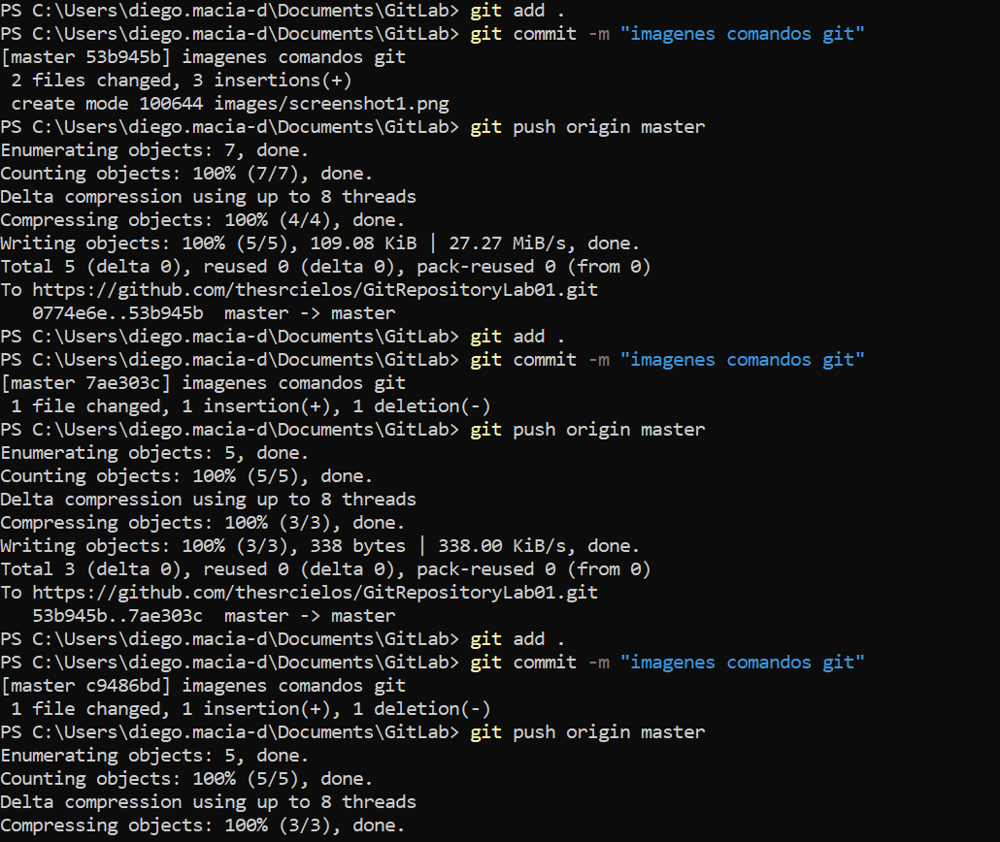

##### Diego Armando Macia Diaz

# Parte 1

## Respuesta preguntas

## ¿para qué sirve y como se usan estos comandos git add y git commit -m “mensaje”?

### git add
##### Este comando sirve para agregar archivos al stage de git para luego ser guardados. Se usa como git add ruta-archivos.

### git commit -m "mensaje"
##### Este comando se usa para guardar localmente los archivos que se añadieron al stage. Cuando se usa es como si se tomara una foto de los archivos guardados en ese momento, podemos volver a revisar estas "fotos" cuando sea necesario. Para usarse se necesitan haber añadido archivos con git add y usar el comando git commit -m "mensaje" para guardar los archivos seleccionados con el mensaje que queramos ponerle.

## Comandos Git imagenes

